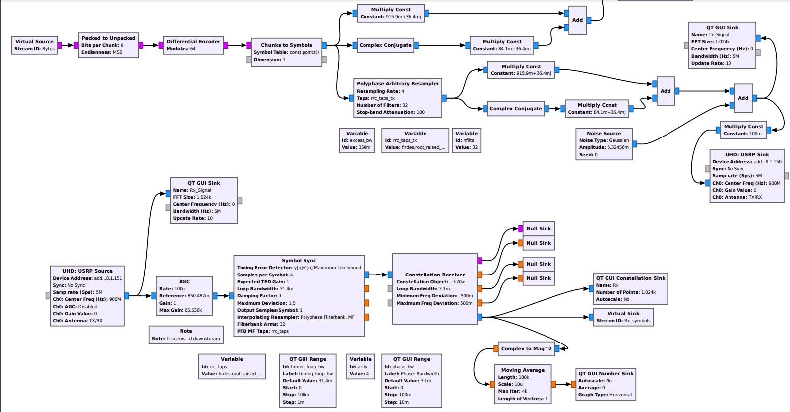

# Sofware-Defined Radio Testbed for I/Q Imbalanced Communication Systems
This repository contains the code for the paper with the same title submitted to the MDPI Electronics.

## Getting Started
You will find the GNU Radio companion flowgraphs (.grc) and Python files for the constellations QPSK, 16-QAM, 64-QAM and 16-PAM. For instructions on installing GNU Radio check [here](https://wiki.gnuradio.org/index.php/InstallingGR) . To run the flowgraphs you will need to install the out-of-tree module gr-demostrador (for instructions, check [here](https://wiki.gnuradio.org/index.php/OutOfTreeModules)).
Mind that the GNU Radio version is 3.9. Nevertheless, the only blocks needed are demonstrator_crc32_check and disp_meas, which may be installed manually in a different version. Parameters for that block are:
- **Rate number of packets** -> Number of packets used for each SER measurement.
- **L symbols** -> Number of symbols of the payload. For instance, for 16-QAM and a payload of 100 bytes L = 100*8/4 = 200.
- **User label** -> Label for the display.

You will also have to change the ursp address in the blocks UHD:USRP Source and UHD:USRP Sink to match the address of your hardware.

## Important Considerations
Mind that, when changing the receiver (from IQI-aware to non-aware) the parameter *const_iq* must be changed to *const* in the following blocks:
- **Constellation Receiver**
- **Constellation Decoder**

Additionally, the reference of the AGC must be set to 1 since the receiver assumes a constellation with unit power.

## Future Improvements
There are two ideas for future improvements of the system.
- For the IQI-aware, the AGC reference value seems to need some fine-tuning (see the note in the flowgraph). Make sure the value is generated automatically.
- IQI constellations lack rotational symmetry, posing a problem because the Constellation Receiver sometimes locks onto a rotated version of the constellation. While this can be addressed by manually rotating or resetting the system, the goal is to implement future code to automate this adjustment.

